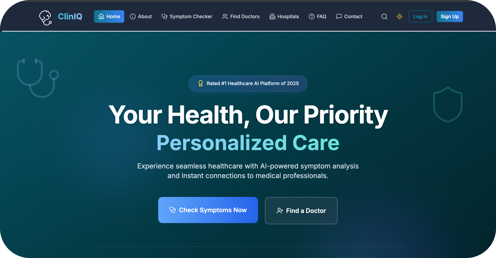
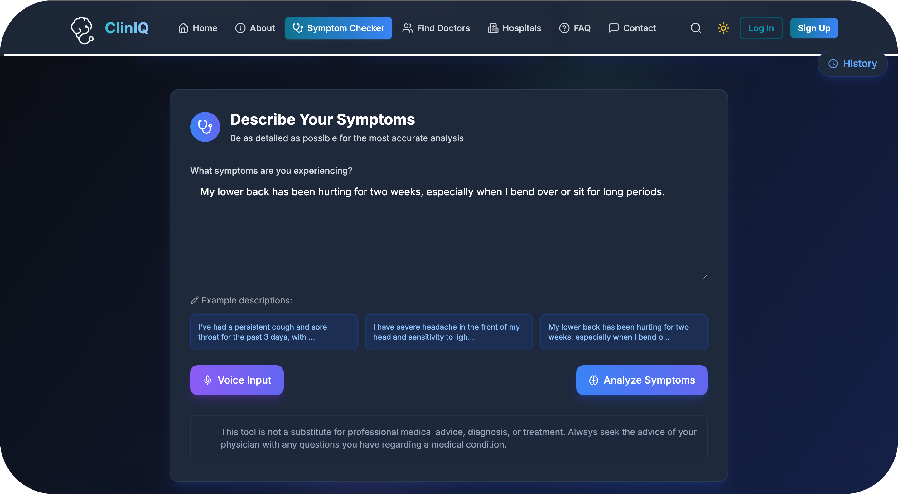

# ClinIQ – AI-Powered Health Platform

[](https://github.com/aksh-g/ClinIQ/actions/workflows/ci.yml)
[](LICENSE)
[](CONTRIBUTING.md)
[](https://cliniq-iota.vercel.app/)

ClinIQ is an innovative open-source health-tech platform that leverages AI to provide accurate symptom analysis and doctor discovery—all in one place. Our goal is to make healthcare more accessible and user-friendly for everyone.

> **Note:** This project was successfully launched during Hacktoberfest 2025 and continues to welcome contributions from the open-source community.

---

## 🚀 Live Demo

[🔗 Visit ClinIQ](https://cliniq-iota.vercel.app/)

---

## 📸 Screenshots

**Homepage:**


**Symptom Checker:**


---

## 💡 The Problem

Millions face delays and confusion when accessing healthcare. Getting a preliminary understanding of symptoms can be difficult, and finding the right specialist is often a challenge.

## 🩺 Our Solution

ClinIQ addresses these challenges by providing:

- 🧠 **AI Symptom Checker:** Get instant, personalized health insights.
- 👩‍⚕️ **Doctor Directory:** Find verified specialists by expertise.
- 💬 **Chat Interface:** An interactive way to get feedback on symptoms.
- 📱 **Responsive UI:** A modern and smooth user experience on any device.
- 📅 **Appointment Booking:** Book and manage appointments with ease.
- 🏥 **Hospital Locator:** Find nearby hospitals using your PIN code.

---

## 🚀 Getting Started

Follow these steps to get a local copy running:

### Prerequisites

- Node.js (v18 or higher)  
- npm or yarn  

### Installation

1. **Fork the repository**  
2. **Clone the repository**  
    ```sh
    git clone https://github.com/YOUR_USERNAME/ClinIQ.git
    ```
3. **Navigate to the project directory**  
    ```sh
    cd ClinIQ
    ```
4. **Install dependencies**  
    ```sh
    npm install
    # or
    yarn install
    ```
5. **Set up environment variables**  
   Copy `.env.example` to `.env` and fill in your keys.  
   - **Supabase:** Sign up at [https://supabase.com/](https://supabase.com/) to get `VITE_SUPABASE_URL` and `VITE_SUPABASE_ANON_KEY`.  
   - **Gemini API:** Get your key from [https://aistudio.google.com/api-keys](https://aistudio.google.com/api-keys).

6. **Run the development server**  
    ```sh
    npm run dev
    # or
    yarn dev
    ```
Open [http://localhost:5173](http://localhost:5173) in your browser to view the app.

---

## 👨‍💼 Project Leadership

As **Project Admin** during **Hacktoberfest 2025**, I spearheaded both the technical development and community growth of ClinIQ. Here's what that looked like:

### 🏗️ Technical Contributions
- **Full-Stack Architecture:** Designed and built the entire system using React, TypeScript, Supabase, and Gemini AI—from database schema to UI components
- **Core Features:** Developed the AI symptom checker, doctor discovery system, appointment booking flow, and role-based dashboards for patients and doctors
- **Database Engineering:** Architected PostgreSQL schema with proper relationships, Row Level Security (RLS) policies, and data integrity constraints
- **UI/UX Development:** Created responsive, accessible interfaces with Tailwind CSS and smooth animations using Framer Motion

### 🤝 Community & Project Management
- **Open Source Leadership:** Managed issues and pull requests during Hacktoberfest, maintaining code quality while welcoming diverse contributions from the community
- **Contributor Support:** Mentored developers (including first-time contributors) through code reviews, issue discussions, and technical guidance
- **Documentation:** Wrote clear setup guides, contributing guidelines, and inline code documentation to lower the barrier for new contributors
- **Deployment & DevOps:** Set up CI/CD pipeline and production deployment, ensuring the platform is accessible to real users

### 🎯 Impact
This project taught me how to balance technical excellence with community building—writing clean, maintainable code while fostering an inclusive environment for contributors of all skill levels. The result is a production-ready healthcare platform that's both technically sound and community-driven.

---

## 🤝 Contributing

We welcome contributions from developers of all skill levels! Whether you're fixing bugs, adding features, or improving documentation, your help makes ClinIQ better.

Please read our [**CONTRIBUTING.md**](CONTRIBUTING.md) for detailed instructions.

### How to Contribute

1. **Fork the repository** and create a new branch for your feature/fix
2. **Make your changes** following our code style and conventions
3. **Test thoroughly** to ensure nothing breaks
4. **Submit a pull request** with a clear description of your changes
5. **Respond to feedback** from maintainers during code review

### Branch Naming Convention

- `feature/feature-name` - For new features
- `fix/bug-description` - For bug fixes
- `docs/update-description` - For documentation updates
- `refactor/component-name` - For code refactoring

### Issue Labels

- `good first issue`: Ideal for newcomers.  
- `hacktoberfest`: Issues for Hacktoberfest contributors.  
- `bug`: Something isn’t working as expected.  
- `UI/UX`: Involves improving interface or user experience.  

---

## 🧰 Tech Stack

| Layer    | Technologies                               |
| :------- | :----------------------------------------- |
| Frontend | React.js, TypeScript, Tailwind CSS, Framer Motion |
| Backend  | Supabase                                   |
| Database | Supabase (PostgreSQL)                      |
| AI API   | Gemini API                                 |

[](https://reactjs.org/)
[](https://tailwindcss.com/)
[](https://supabase.com/)
[](https://developers.google.com/)

📐 **[View Full Architecture Overview →](./ARCHITECTURE_OVERVIEW.md)**

---

## 🗺️ Future Roadmap

- 📊 **Advanced Dashboards:** For patients, doctors, and admins with actionable insights.  
- 🔐 **Enhanced Security:** End-to-end encryption and role-based access controls.  
- 🔔 **Real-time Notifications:** Appointment alerts and health reminders.

---

## 📝 License

This project is licensed under the MIT License. See the [LICENSE](LICENSE) file for details.

---

## ⭐ Star Our Repo!

If you find ClinIQ helpful, please give it a ⭐ star on [GitHub](https://github.com/aksh-g/ClinIQ)!

---

## 📬 Contact

For questions or feedback, reach out to [akshay.allen26200@gmail.com](mailto:akshay.allen26200@gmail.com)
